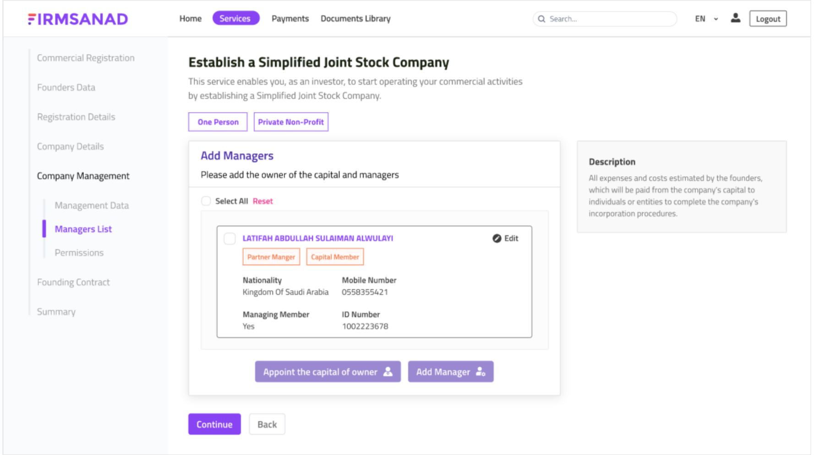

# Firmsanad

INTRODUCTION

FIRMSANAD is a pioneering platform that bridges the gap between your business aspirations and the regulatory landscape of Saudi Arabia. We understand that embarking on a new business venture or expanding your existing one can be challenging, and that's where FIRMSANAD comes in.

SYSTEM FEATURES

1. FIRMSANAD offers an intuitive and user-friendly interface, ensuring a smooth and hassle-free experience for users of all backgrounds.
2. Whether you're looking to register a new business, obtain licenses, or manage ongoing compliance, FIRMSANAD provides comprehensive solutions to meet your needs.
3. We believe in transparency throughout the process. Users can easily track their applications and stay informed about their progress.
4. Save time and resources with FIRMSANAD's efficient processes. Focus on growing your business while we take care of the administrative details.

TECNICALITIES/TOOLS USED

1. ASP .NET core
2. ReactJS
3. RESTAPIs
4. Nafath Integration
5. AWS Server
6. GOSI Integration

SYSTEM SCREENSHOTS

 

SYSTEM PROTOTYPES

Admin Portal: https://xd.adobe.com/view/4c80b6b9-ad76-4fda-8507-0bb90ed7f328-19d3/screen/72396652-306e-46c9-ad9d-250b7de39056

Foreign Client: https://xd.adobe.com/view/94031bd6-a977-4b6d-a108-8043371585ee-c150/

Local Client: https://xd.adobe.com/view/18ed8cbb-a083-4d19-97a6-13cd952e7a75-4dbe/
